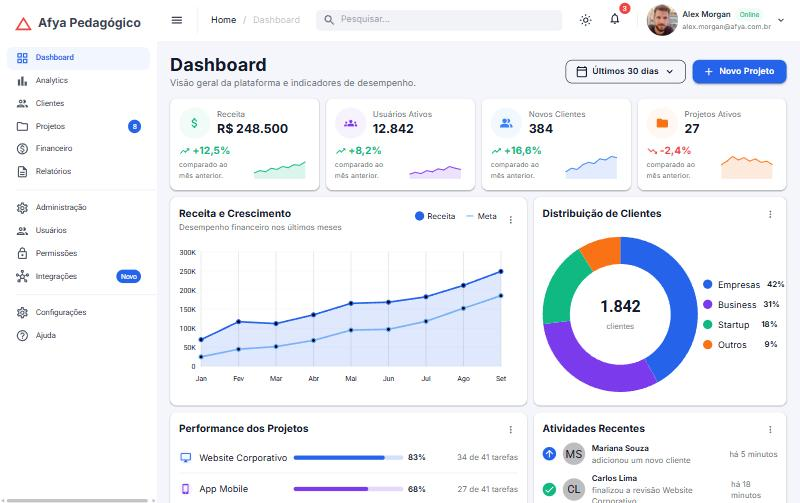
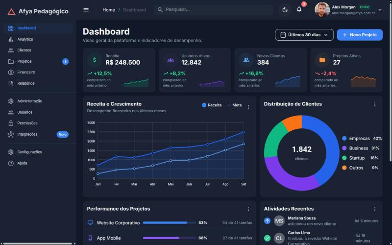
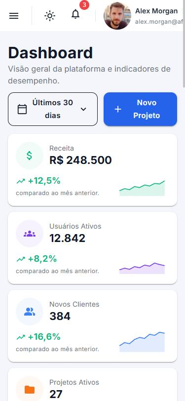
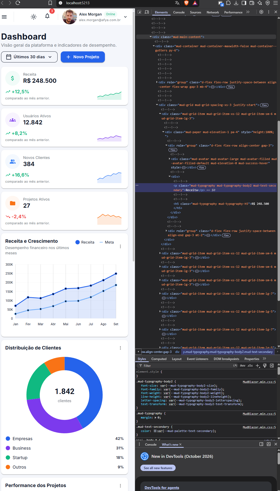

# Afya Admin — Dashboard com Blazor WebAssembly e MudBlazor

## Identificação

| | |
|---|---|
| **Aluno(a)** | Lucas Gabriel Barreto Oliveira |
| **Matrícula** | PREENCHER |
| **Faculdade** | PREENCHER |
| **Curso** | PREENCHER |
| **Disciplina** | Programação para Sistemas Web |
| **Professor(a)** | PREENCHER |
| **Semestre** | 2026.2 |

## Objetivo do projeto

PREENCHER — explique com suas palavras o objetivo do projeto e o que a página faz (2 a 4 parágrafos).

## Tecnologias utilizadas

- .NET 10 / Blazor WebAssembly (standalone)
- MudBlazor 9 (componentes, tema e classes utilitárias)
- C# e Razor
- Fonte Inter (Google Fonts)
- Git e GitHub

## Como executar

É necessário o **.NET SDK 10** (o projeto foi desenvolvido com a versão 10.0.401). Confira com `dotnet --version`.

```bash
git clone https://github.com/Prequelunsainted/afya-admin.git
cd afya-admin
dotnet watch
```

O `dotnet watch` compila, abre o navegador e recarrega a página a cada alteração salva. A URL aparece no terminal (neste projeto, `http://localhost:5213`).

## Telas

### Tema claro


### Tema escuro


### Versão mobile


### HTML gerado (DevTools)


O print mostra a aba Elements com o card de KPI "Receita" inspecionado:

- o `<MudPaper Elevation="1" Class="pa-4" Height="100%">` do `KpiCard.razor` virou `<div class="mud-paper mud-elevation-1 pa-4" style="height:100%;">`: a classe utilitária `pa-4` escrita no código aparece igual no HTML final;
- o `<MudStack Row="true" Spacing="3" AlignItems="AlignItems.Center">` virou `<div role="group" class="d-flex flex-row align-center gap-3">`;
- o `<MudText Typo="Typo.body2" Class="mud-text-secondary">` virou `<p class="mud-typography mud-typography-body2 mud-text-secondary">`, e o valor com `Typo.h5` virou um `<h5>`;
- cada `<MudItem xs="12" sm="6" lg="3">` do `Dashboard.razor` virou uma `<div>` com as classes `mud-grid-item-xs-12 mud-grid-item-sm-6 mud-grid-item-lg-3`.

## Estrutura do projeto

```
afya-admin/
├── Components/
│   ├── AtividadesRecentes.razor
│   ├── CabecalhoPagina.razor
│   ├── DashboardCard.razor
│   ├── GraficoDistribuicaoClientes.razor
│   ├── GraficoReceita.razor
│   ├── KpiCard.razor
│   ├── PerformanceProjetos.razor
│   ├── ProjetosRecentes.razor
│   ├── SeletorPeriodo.razor
│   └── Ui.cs
├── Data/
│   └── DashboardData.cs
├── Layout/
│   ├── MainLayout.razor
│   └── NavMenu.razor
├── Pages/
│   ├── Dashboard.razor
│   └── NotFound.razor
├── Properties/
│   └── launchSettings.json
├── docs/
│   └── prints/
├── wwwroot/
│   ├── css/app.css
│   ├── img/alex-morgan.jpg
│   ├── favicon.png
│   ├── icon-192.png
│   └── index.html
├── _Imports.razor
├── afya-admin.csproj
├── App.razor
└── Program.cs
```

| Pasta | Papel |
|---|---|
| `Components` | componentes visuais reutilizáveis do dashboard e a classe auxiliar `Ui` |
| `Data` | modelos (`record`) e os dados fictícios usados pela página |
| `Layout` | a moldura da aplicação: tema, AppBar, sidebar e menu de navegação |
| `Pages` | as páginas com rota (`@page`): o Dashboard e a página 404 |
| `wwwroot` | arquivos estáticos servidos ao navegador: `index.html`, CSS do template, imagens e ícones |

## Componentes criados

| Componente | Responsabilidade | Parâmetros que recebe |
|---|---|---|
| `CabecalhoPagina` | título e subtítulo da página à esquerda e uma área de ações à direita | `Titulo` (obrigatório), `Subtitulo`, `Acoes` (`RenderFragment`) |
| `SeletorPeriodo` | menu com aparência de botão para escolher o período; avisa a página quando o valor muda | `Opcoes` (obrigatório), `Valor`, `ValorChanged` (`EventCallback<string>`) |
| `DashboardCard` | card base com título, subtítulo opcional, ações, menu "⋮" opcional e conteúdo | `Titulo` (obrigatório), `Subtitulo`, `Acoes`, `Menu`, `ChildContent` (`RenderFragment`) |
| `KpiCard` | card de indicador com ícone, valor, variação e mini gráfico de tendência (sparkline) | `Kpi` (obrigatório) |
| `GraficoReceita` | gráfico de linha Receita x Meta com legenda própria | `Meses`, `Receita`, `Meta` (todos obrigatórios) |
| `GraficoDistribuicaoClientes` | gráfico de rosca com o total no centro e legenda com percentuais | `Total`, `Segmentos` (obrigatórios) |
| `PerformanceProjetos` | lista de projetos com barra de progresso, percentual e tarefas concluídas | `Projetos` (obrigatório) |
| `AtividadesRecentes` | feed com ícone da ação, avatar com iniciais, descrição e tempo | `Atividades` (obrigatório) |
| `ProjetosRecentes` | tabela de projetos com status, progresso e menu de ações; vira lista de cards no celular | `Projetos` (obrigatório) |

`Ui.cs` não é um componente: é uma classe estática com `FundoSuave(Color)`, que devolve a classe utilitária de fundo suave da cor, e `Iniciais(string)`, que devolve as iniciais de um nome.

## O que aprendi

PREENCHER — responda com suas próprias palavras, um parágrafo curto por pergunta.

1. Como uma aplicação Blazor WebAssembly inicia no navegador? Qual é o papel do `index.html`, da `<div id="app">` e do `Program.cs`?
2. Qual é a diferença entre um **Layout**, uma **Page** e um **Component** neste projeto? Dê um exemplo de cada.
3. O que é um `RenderFragment` e como o `DashboardCard` usa esse recurso para ser reutilizado por vários cards?
4. Como funciona o `@bind-Valor` no `SeletorPeriodo`? Qual é o papel do `ValorChanged`?
5. Por que os dados ficam na pasta `Data`, separados dos componentes? Que vantagem isso traz se, no futuro, os dados vierem de uma API?
6. Como o `MudGrid` com `xs`, `sm` e `lg` faz os cards de KPI se reorganizarem em telas de tamanhos diferentes?
7. Como foi possível estilizar a página inteira sem escrever CSS? Explique o papel do tema (`MudTheme`) e das classes utilitárias.
8. Por que o namespace do projeto é `afya_admin` e não `afya-admin`?

## Dificuldades e soluções

PREENCHER — descreva pelo menos dois problemas que você enfrentou durante o desenvolvimento e como resolveu cada um.

## Melhorias futuras (opcional)

PREENCHER
